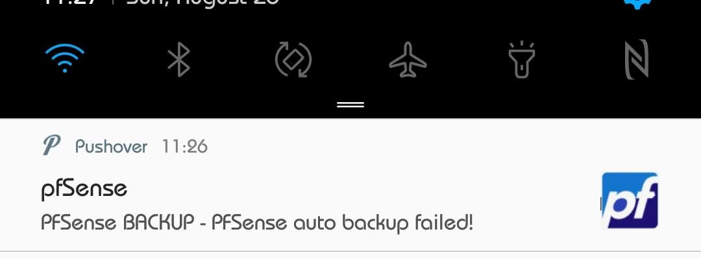

# breadsPFsenseAutoBackup

A script utilizing [KoenZomers pfSenseBackup](https://github.com/KoenZomers/pfSenseBackup) exe to automate PFSense backups. 
I'm all about setting it and forgetting it and hopefully this script helps you do that. It's currently setup to only alert if there is a failure.

- ```pfsensebackup.ps1``` A simple Powershell script that uses [pfSenseBackup](https://github.com/KoenZomers/pfSenseBackup) to create the backup. It has some error checking, logs everything it does, auto-deletes old backups after 'x' days and has the ability to alert using Pushover in case of an error using [copypastedevelopers](https://github.com/copypastedeveloper/PushoverCli) pushover CLI. 

### Prerequisites

This script requires following:
- A windows machine
- [KoenZomers pfSenseBackup](https://github.com/KoenZomers/pfSenseBackup)
- [copypastedevelopers pushoverCLI](https://github.com/copypastedeveloper/PushoverCli) (Only if you want to use pushover notifications)

### Mandatory variables to set
1. $backupdir = "\" #where your backup files will go (leave a trailing \)
2. $appdir = "\" #where the exe lives (leave a trailing \)
3. $username = "" #PFSense Username
4. $pw = "" #PFSense Password
5. $pfaddress = "192.168.x.x" #PFSense address
6. $retention = "-30" #how many days to keep old backup files (Must be negative value, -30 = files older than 30 days)
7. $fileName = "pfsensebackup" #name of your log file (put into your $backupdir)
8. $usepush = "y" #use pushover? (y or n)
9. $pushoverapp = "c:\somepath\pushovercli.exe" #location of the pushovercli
10. $minbackups = "5" #minimum number of backup files before files are auto-deleted

## Instructions
1. Open the pfSenseBackup.ps1 script and edit all the variables above
2. Create a new scheduled task in Windows with the following:
   - General Tab "Run whether a user is logged in or not" selected -> Action "Start a program" -> Program/Script "Powershell" -> Add Arugments "-f c:\pathtoyourscript\script.ps1"


## TODO
```backupPFsense.ps1```
- [ ] Add a "check variables" statement before the script executes anything... (should stop some bugs)
- [x] Remove pushover dependency
- [ ] Add option to toggle logging on or off
- [ ] Add a linux version
- [x] Add ability to keep a minimum number of backup files (in case something goes horribly wrong, don't want the script deleting old files as they age)

## Screenshots
- 
- 

## Built With
* Powershell

## Authors
* **badbread** - *Initial work* - [badbread](https://github.com/badbread)

## Acknowledgments
- [KoenZomers pfSenseBackup](https://github.com/KoenZomers/pfSenseBackup)
- [copypastedevelopers pushoverCLI](https://github.com/copypastedeveloper/PushoverCli)

