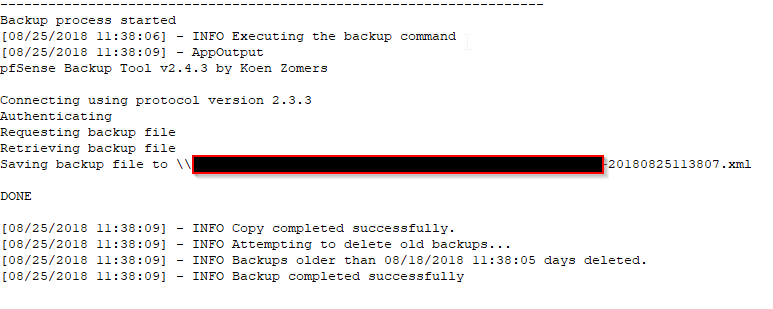

# breadsPFsenseAutoBackup

- ```pfsensebackup.ps1``` A script utilizing [KoenZomers pfSenseBackup](https://github.com/KoenZomers/pfSenseBackup) exe to automate PFSense backups. 
- ```pfsensebackupv2.ps1``` Completely re-written script which automates the variable input process, way less BASH like where all variables are set on first run of the script and stored in an xml file

I'm all about setting it and forgetting it and hopefully this script helps you do that. 

### Features

```pfsensebackup.ps1```
- Logs everything it does
- Pushover alerts using [copypastedevelopers](https://github.com/copypastedeveloper/PushoverCli) pushover CLI. 
   - Can be toggled on or off, and can choose between alerting always or only on a failure
- Auto-deletes old backups after 'x' days
   - Only auto-deletes if 'x' number of backup files exist

```pfsensebackupv2.ps1```
- Does everything above
- On first run prompts for all the variables and stores them in an XML file in the scripts location
- Uses [Kieranties PS-Pushover](https://github.com/Kieranties/PS-Pushover) for pushover notifications
   
### Prerequisites

Both scripts requires following:
- A windows machine
- [KoenZomers pfSenseBackup](https://github.com/KoenZomers/pfSenseBackup)

- ```pfsensebackup.ps1```
- [copypastedevelopers pushoverCLI](https://github.com/copypastedeveloper/PushoverCli) (Only if you want to use pushover notifications)

- ```pfsensebackupv2.ps1```
- Uses [Kieranties PS-Pushover](https://github.com/Kieranties/PS-Pushover) for pushover notifications

### Mandatory variables to set
```pfsensebackup.ps1```
1. $backupdir = "\" #where your backup files will go (leave a trailing backslash)
2. $appdir = "\" #where the exe lives (leave a trailing backslash)
3. $username = "" #PFSense Username
4. $pw = "" #PFSense Password
5. $pfaddress = "192.168.x.x" #PFSense address
6. $retention = "-30" #how many days to keep old backup files (Must be negative value, -30 = files older than 30 days)
7. $fileName = "pfsensebackup" #name of your log file (put into your $backupdir)
8. $usepush = "y" #use pushover? (y or n)
9. $pushoverapp = "c:\somepath\pushovercli.exe" #location of the pushovercli
10. $minbackups = "5" #minimum number of backup files before files are auto-deleted


```pfsensebackup2.ps1```
- None, automatic

## Instructions
```pfsensebackup.ps1```
1. Open the pfSenseBackup.ps1 script and edit all the variables above
2. Create a new scheduled task in Windows with the following:
   - General Tab "Run whether a user is logged in or not" selected -> Action "Start a program" -> Program/Script "Powershell" -> Add Arguments "-f c:\pathtoyourscript\pfsensebackup.ps1"

```pfsensebackupv2.ps1```
1. Place the pfsensebackupv2.ps1 script and [Kieranties PS-Pushover](https://github.com/Kieranties/PS-Pushover) in the same directory
2. The script should create "autobackupconfig.xml" file in the same dir
3. Create a new scheduled task in Windows with the following:
   - General Tab "Run whether a user is logged in or not" selected -> Action "Start a program" -> Program/Script "Powershell" -> Add Arguments "-f c:\pathtoyourscript\pfsensebackupv2.ps1"

## TODO
```backupPFsense.ps1```
- [ ] Add a "check variables" statement before the script executes anything... (should stop some bugs)
- [x] Remove pushover dependency
- [ ] Add option to toggle logging on or off
- [ ] Add a linux version
- [x] Add ability to keep a minimum number of backup files (in case something goes horribly wrong, don't want the script deleting old files as they age)

## Screenshots
- 
- 

## Built With
* Powershell

## Authors
* **badbread** - *Initial work* - [badbread](https://github.com/badbread)

## Acknowledgments
- [KoenZomers pfSenseBackup](https://github.com/KoenZomers/pfSenseBackup)
- [copypastedevelopers pushoverCLI](https://github.com/copypastedeveloper/PushoverCli)
- [Kieranties PS-Pushover](https://github.com/Kieranties/PS-Pushover)
